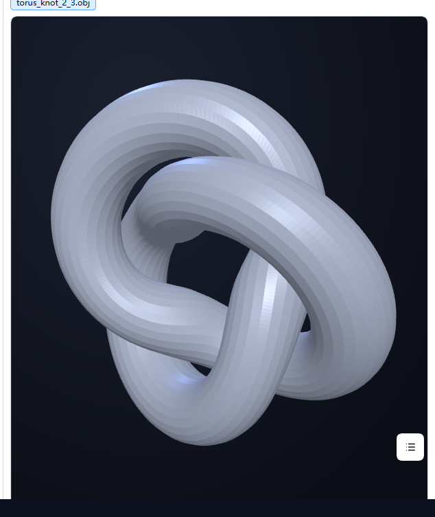

# dsh-plugin-3d-viewer

给 [DeepSeek Harness](https://github.com/deepseek-ai/deepseek-harness)（DSH）用的**三维查看器插件**：
把助手消息里的 `3d` 代码块（或 `[3d:路径]` 链接）**原地渲染**成可旋转/缩放的三维视图，
并在 DSH **右侧栏**提供一个「本会话出现过的 3D 模型」常驻预览面板。

模型文件通过宿主路由 `GET /model3d/<工作区内绝对路径>` 同源只读读取，**浏览器端不需要 file:// 或任何本地服务**。



---

## 功能

| 功能 | 说明 |
|---|---|
| 消息内联查看 | 助手消息里写 ` ```3d ` 代码块（块内是模型文件绝对路径）或 `[3d:路径]` 链接 → 原地变成三维视图 |
| 右侧栏面板 | 列出**当前会话里出现过的**三维模型，点文件名即切换；面板常驻，不占聊天区 |
| 一键送侧栏 | 聊天里每个三维视图右上角有「侧栏预览」按钮，点一下把该模型送到右侧栏 |
| 操作方式 | 左键拖动 = 旋转；滚轮 = 缩放；右键拖动 = 平移；双击 = 恢复初始视角 |
| 支持格式 | `.obj` / `.stl` / `.gltf` / `.glb` |
| 缩放自适应 | 缩放范围按模型尺寸自动计算（BIM/CAD 导出的超大坐标模型也能正常缩放） |
| 安全兜底 | 同时最多 4 个三维视图、短时间异常挂载自动熔断、自诊断出口 `window.__dsv3d` |

---

## 安装（DSH 插件手动安装）

1. **放插件目录**：把本仓库内容放到 `$DSH_HOME/plugins/3d-viewer/`（`$DSH_HOME` 通常是 `~/.dsh`）。
2. **建 junction / 符号链接**到当前 profile 的 node_modules：
   ```powershell
   # Windows（web profile）
   New-Item -ItemType Junction -Path "$DSH_HOME\profiles\web\node_modules\dsh-plugin-3d-viewer" -Target "$DSH_HOME\plugins\3d-viewer"
   ```
3. **在 profile 补丁里挂载**：编辑 `$DSH_HOME/profiles/web/cordis.patch.yml`，在插件组里加一条：
   ```yaml
   - insert:
       - id: 3d-viewer
         name: dsh-plugin-3d-viewer
   ```
4. **重启宿主**（宿主半路由是进程启动时加载的）：
   ```powershell
   # 停掉当前 dsh web 宿主后重新启动（具体命令按你的启动方式）
   ```

> 客户端半（`lib/client.js`）由宿主**按请求读盘**，改完只需**刷新页面**（`Ctrl+F5`）即生效，不必重启。

---

## 使用

在消息里让助手输出任意一种写法：

````
```3d
D:\models\demo.obj
```
````

或

```
[3d:D:\models\pump.glb]
```

**右侧栏面板的两种打开方式**：

1. 点任意三维视图右上角的「**侧栏预览**」→ 右侧栏自动展开并显示该模型；
2. 展开右侧栏 → 在页面列表里选「**3D 模型预览**」→ 列出本会话出现过的所有模型。

---

## 配置

| 环境变量（宿主进程） | 默认 | 说明 |
|---|---|---|
| `DSH_3D_VIEWER_REPRO_ROOT` | 空 | 开发用：指向一个只读目录即可启用 `GET /repro/...` 静态测试页。**留空则不注册该路由**（发布安装不会暴露任何本地目录） |

客户端内置上限（`lib/client.js` 顶部常量）：

| 常量 | 默认值 | 含义 |
|---|---|---|
| `MAX_VIEWERS` | 4 | 同时存活的三维视图上限（超过则回收最旧的，防 WebGL 上下文耗尽） |
| `BREAKER_MAX` | 40 | 熔断阈值：`BREAKER_WINDOW_MS`（8 秒）内挂载超过这个数就停止自动挂载 |
| `THREE_TIMEOUT_MS` | 8000 | three.js 源加载超时（超时换下一个源，不再无限转圈） |

**自诊断**：浏览器控制台输入 `__dsv3d` 可看到当前状态（存活查看器数、缩放半径范围、是否触发熔断）；
`__dsv3dPanel` 可看到侧栏面板登记的模型清单。

---

## 工作原理

```
助手消息 ---> 客户端扫描器（pre / a[href^="/model3d/"]）
                 |
                 |-- 认出模型绝对路径 --> /model3d/<url-encoded 绝对路径>
                 |                            |
                 |                            v
                 |                     宿主半（lib/index.js）同源只读路由
                 |                     校验：GET/HEAD、同源、绝对路径、无 ..、扩展名白名单、≤60 MiB
                 v
            Three.js 渲染（按需渲染：只在交互/尺寸变化/进入视口时画一帧）
```

- **three.js 按需从 CDN 加载**（jsDelivr → npmmirror → unpkg 依次兜底），源加载有 8 秒超时。
- **加载器（OBJLoader/STLLoader/GLTFLoader）取回源码后改写模块说明符再用 blob 动态 import** ——
  因为 three.js 的 `examples/jsm` 加载器源码里用的是裸模块名 `from 'three'`，浏览器在没有 import map 时无法解析。
- **扫描器不会处理"已挂载视图内部"的节点**（`node.closest("[data-dsv3d]")`）——这是下面那个 bug 的根治手段。

---

## 修复史（三段真 bug，都有复现证据）

### 1. 自我复制死循环导致整个界面无响应（致命）

**现象**：消息里出现 `3d` 代码块时，**整个页面立刻失去响应，连 F12 都打不开**。

**机制**：查看器自己会生成一个「新标签页打开模型」的链接 `<a href="/model3d/...">`，
而扫描器正是用 `a[href^="/model3d/"]` 找触发点 → **把查看器自己刚生成的链接又当成新触发点**，
再挂一个查看器、再生成一个同样的链接……全程跑在 `MutationObserver` 的微任务里，
主线程永远回不到事件循环。

**量化实测**（无头浏览器，把第 200 次自建链接掐断以便计数）：
**1 个触发点 → 21 毫秒内挂出 399 个查看器 / 199 个 WebGL 上下文 / 200 个自建链接**；
不掐断时脚本调用永不返回。

**修复**：
- 扫描器跳过「已挂载视图内部」的节点（`node.closest("[data-dsv3d]")`）；
- 自建链接显式标记 `data-dsv3d-skip`，永不作为触发点；
- 加 `MAX_VIEWERS` 上限、8 秒熔断器、单次 observer 回调最多处理 6 个挂载点。

### 2. 模型从来显示不出来（裸模块名）

`Failed to resolve module specifier "three"` —— three.js 的 `examples/jsm` 加载器源码用裸模块名
`from 'three'`（`GLTFLoader` 还 import 相对路径的 `../utils/BufferGeometryUtils.js`，其中同样有裸名），
浏览器没有 import map 无法解析。旧写法「先插 `<script src=three.module.js>` 再 `import()`」治不了
（而且那个 `<script>` 必然抛 `Unexpected token 'export'`，白下载 1.3 MB）。

**修复**：取回加载器源码 → 把 `'three'` 改写成 CDN 绝对 URL（与渲染器**同一份**模块实例）→
相对依赖**递归**改写 → `blob:` URL 动态 import。

### 3. 大模型缩放"发涩"

缩放范围曾写死为 `0.02 ~ 500`；BIM/CAD 导出的模型尺寸可达上万单位（实测某机组模型 10022×2920×2511），
一滚滚轮就被砍到 500（瞬间贴脸 33 倍）且再也拉不回来。

**修复**：`minRadius = 模型尺寸 × 1%`、`maxRadius = 模型尺寸 × 20`、`camera.near/far` 同步自适应。

---

## 回归测试

`tools/cascade-test.cjs` 用无头浏览器驱动**真实 DSH 页面**验证：
① 单个 `/model3d` 链接与单个 `3d` 代码块都能正确挂载（且不级联）；
② 对照组（普通代码块）不被误挂载；③ 级联计数（掐断阀）证明不会失控。

```powershell
# 依赖：Node 18+、puppeteer-core、Edge/Chrome
$env:DSH_URL      = "http://127.0.0.1:3080"
$env:DSH_TOKEN    = "<你的登录 token>"        # 也可用 DSH_TOKEN_FILE 指向 DSH当前地址.txt
$env:EDGE_PATH    = "C:\Program Files (x86)\Microsoft\Edge\Application\msedge.exe"
$env:MODEL_PATH   = "D:\models\demo.obj"
node tools/cascade-test.cjs A,B,C,D
```

判定：注入动作**不超时**（超时即"页面被冻结"）、`viewers` 稳定在 1~4、面板内 `canvas ≥ 1`、无页面报错。

---

## 兼容性

- 实测环境：DSH web profile `0.1.7-alpha.2`（Chromium/Edge，Windows）。
- 桌面端（Electron）与 web 端共用同一份 `lib/client.js`。
- 右侧栏面板使用 DSH 公开 API `ctx.sidebarRightTabs.register()` 与 `ctx.sidebarRight.openTab()`；
  若宿主没有这两个服务，插件会**自动跳过面板**（聊天内联查看不受影响）。

---

## 许可

[MIT](LICENSE) © 2026 guiyidu-ui
